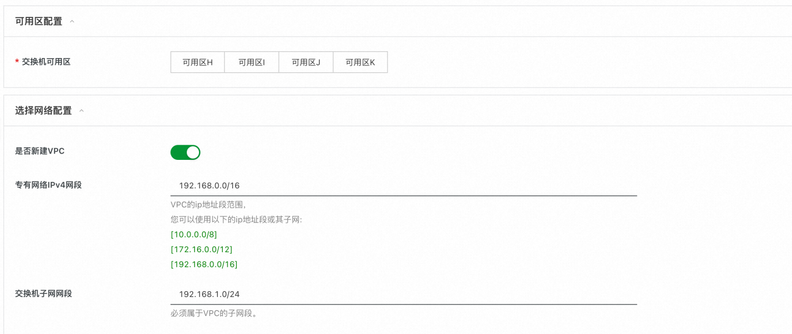
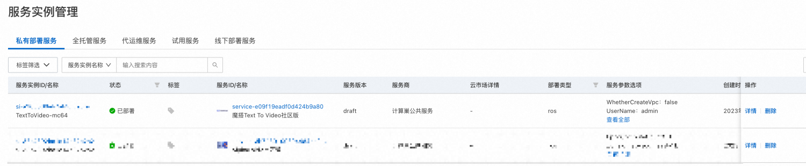
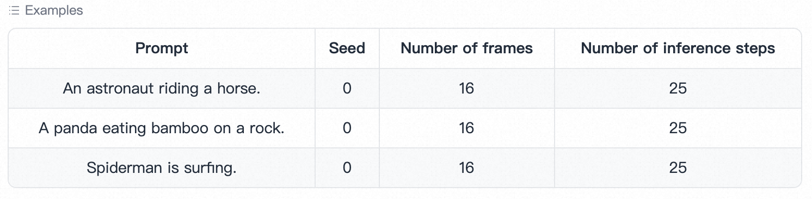

<h1> Overview </h1>

 The text-video generation model is composed of three sub-networks, including the text feature extraction extraction (Text feature model), the text feature-to-video later space diffusion model (Text feature-to-video later space model), and the video later space-to-video visual space mapping model. The overall model parameters are about 1.7 billion. Currently only English input is supported. The diffusion model adopts Unet3D structure, and the pure Gaussian noise video is processed iteratively to achieve video generation. 

<h1> Instance Description </h1>

Text to Video is deployed based on the open source version of the community. Refer to the source code <a href = "https://huggingface.co/damo-vilab/modelscope-damo-text-to-video-synthesis">HuggingFace Model Card</a>. The instance specification packages are as follows:

<table>
<thead>
<tr>
<th> Specification family </th>
<th>vCPU and memory </th>
<th> System disk </th>
</tr>
</thead>
<tbody>
<tr>
<td>ecs.gn6i-c8g1.2xlarge</td>
<td>T4 GPU computing, 8vCPU 31GiB,16G GPU RAM</td>
<td>ESSD 200GiB PL0</td>
</tr>
<tr>
<td>ecs.gn7i-*</td>
<td>A10 GPU Computing, *,24G GPU RAM</td>
<td>ESSD 200GiB PL0</td>
</tr>
</tbody>
</table>

<h1> Deployment process </h1>

<h2>0. Preparations </h2>

 Before you start using it, you need an Alibaba Cloud account to access and create resources such as ECS and VPC. 

<ul>
<li> If you use a personal account, you can directly create a service instance. </li>
<li> If you use a RAM user to create a service instance and this is the first time you use Alibaba Cloud Compute
<ul>
<li> Before creating a service instance, add the corresponding resource permissions to the account of the RAM user. For more information about how to add RAM permissions, see <a href = "https://help.aliyun.com/document_detail/121945.html"> Authorize RAM users </a>. The required permissions are shown in the following table. </li>
<li> and need to authorize the creation of associated roles, refer to the following figure, select agree to authorize and create associated roles </li>
</ul></li>
</ul>

<table>
<thead>
<tr>
<th> Permission policy name </th>
<th> Remarks </th>
</tr>
</thead>
<tbody>
<tr>
<td>AliyunECSFullAccess</td>
<td> Permissions to manage ECS </td>
</tr>
<tr>
<td>AliyunVPCFullAccess</td>
<td> Permissions for managing VPC networks </td>
</tr>
<tr>
<td>AliyunROSFullAccess</td>
<td> Manage permissions for Resource Orchestration Services (ROS) </td>
</tr>
<tr>
<td>AliyunComputeNestUserFullAccess</td>
<td> Manage user-side permissions for the compute nest service (ComputeNest) </td>
</tr>
</tbody>
</table>

<h2>1. Deployment portal </h2>

 You can search by yourself in <a href = "https://computenest.console.aliyun.com/user/cn-hangzhou/recommendService"> Alibaba Cloud computing nest </a>, or you can quickly reach it through the following deployment link.  <a href = "https://computenest.console.aliyun.com/user/cn-hangzhou/serviceInstanceCreate?ServiceId=service-e09f19eadf0d424b9a80"> Deployment link </a>

<h2>2. Create a service </h2>

<h3>2.1 parameter list </h3>

 In the process of creating a service instance, you need to configure the parameter list of service instance information, as follows:

<table>
<thead>
<tr>
<th> Parameter group </th>
<th> Parameter item </th>
<th> Example </th>
<th> Description </th>
</tr>
</thead>
<tbody>
<tr>
<td> Service instance name </td>
<td>N/A</td>
<td>TextToVideo-mc64</td>
<td> Name of the instance </td>
</tr>
<tr>
<td> Region </td>
<td>N/A</td>
<td> China (Hangzhou)</td>
<td> Select the region of the service instance. We recommend that you select the region nearby to obtain better network latency. </td>
</tr>
<tr>
<td> Payment type configuration </td>
<td> Payment type </td>
<td> Pay-As-You-Go </td>
<td>N/A</td>
</tr>
<tr>
<td>ECS instance configuration </td>
<td> Instance type </td>
<td>ecs.gn6i-c8g1.2xlarge</td>
<td> Select T4 GPU package specifications or custom package specifications </td>
</tr>
<tr>
<td>ECS instance configuration </td>
<td> Instance password </td>
<td><strong><em>*</strong><strong>*</em></strong></td>
<td> Set the instance password. It must be 8 to 30 characters in length and must contain three items (uppercase letters, lowercase letters, numbers, and special symbols in ()'~!@#$%^& *_-+ ={}[]:;' <>,.?/). </td>
</tr>
<tr>
<td> Login information configuration </td>
<td> Software login name </td>
<td>admin</td>
<td> Set software login user name </td>
</tr>
<tr>
<td> Login information configuration </td>
<td> Software login password </td>
<td><strong>**</strong></td>
<td> Set software login password </td>
</tr>
<tr>
<td> Availability Zone Configuration </td>
<td> Switch available to go </td>
<td> Availability Zone I</td>
<td> Different available regions under the region, ensure that the instance is not empty </td>
</tr>
<tr>
<td> New Network Configuration </td>
<td> Private network IPv4 network </td>
<td>192.168.0.0/16</td>
<td> IP address range of the VPC </td>
</tr>
<tr>
<td> New Network Configuration </td>
<td> Switch subnet segment </td>
<td>192.168.1.0/24</td>
<td> Switch subnet address range </td>
</tr>
<tr>
<td> Select an existing basic resource configuration </td>
<td>VPC ID</td>
<td>vpc-xxx</td>
<td> According to the actual situation, select the ID of the VPC. </td>
</tr>
<tr>
<td> Select an existing basic resource configuration </td>
<td> Switch ID</td>
<td>vsw-xxx</td>
<td> Select the switch ID as appropriate. If the switch cannot be found, try switching the region and zone. </td>
</tr>
</tbody>
</table>

<h3>2.2 specific steps </h3>

 Create a service as follows, refer to the following figure:

<ul>
<li> Enter the instance name, as shown in TextToVideo-mc64 </li>
<li> Select a region, as shown in the following figure: China (Hangzhou) </li>
</ul>

<ul>
<li> Select payment type </li>
<li> Select the instance type. </li>
<li> Configure an instance password </li>
<li> Configure the software login user name and password </li>
</ul>

<ul>
<li> Select Availability Zone </li>
<li> Select the network configuration (either of the following two cases)
<ul>
<li> Create a VPC and fill in the network configuration </li>
<li> Select an existing network resource </li>
</ul></li>
</ul>

<ul>
<li> Click Next to enter the order confirmation page </li>
<li> Check the check boxes in Permission Confirmation and Terms of Service </li>
<li> Click Create Now </li>
</ul>

<h2>3. Start the Text To Video service </h2>

<ul>
<li> On the Service Instance Management page, wait for the Deployment Status to change to Deployed ". </li>
</ul>

<ul>
<li> Click the service instance to access the service instance details. </li>
<li> Click Endpoint and enter the user name and password when creating the service to log in to the software page. </li>
</ul>

<ul>
<li> Enter English Prompt and click Generate video to generate a video according to the input prompt. </li>
</ul>

<ul>
<li> Click "Advanced options" to set more parameters.
<ul>
<li>Seed. Selecting a different Seed will generate different content. </li>
<li>Number of frames. Number of video frames. </li>
<li>Number of inference steps. The number of inference steps. The higher the value, the longer the time and the better the content. </li>
</ul></li>
</ul>

<ul>
<li> Click the Examples to view the example directly. </li>
</ul>

 Finally, please try to play with your imagination. Have any ideas or suggestions or cooperation needs, please contact us ~~~

