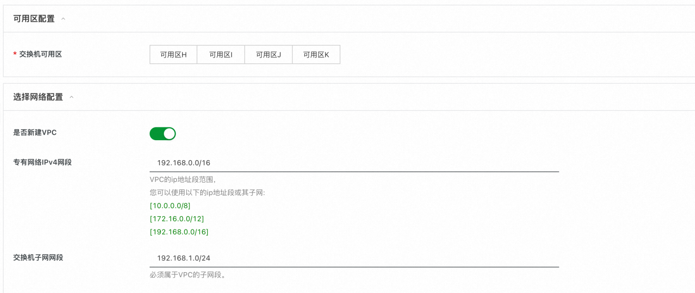
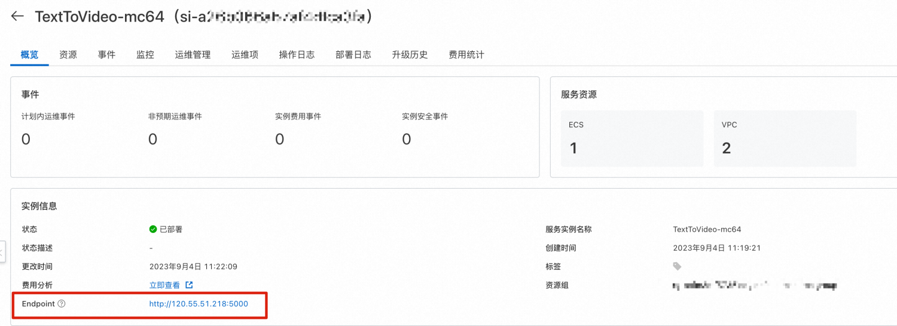
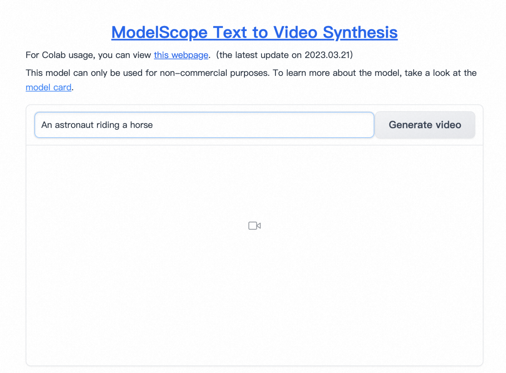
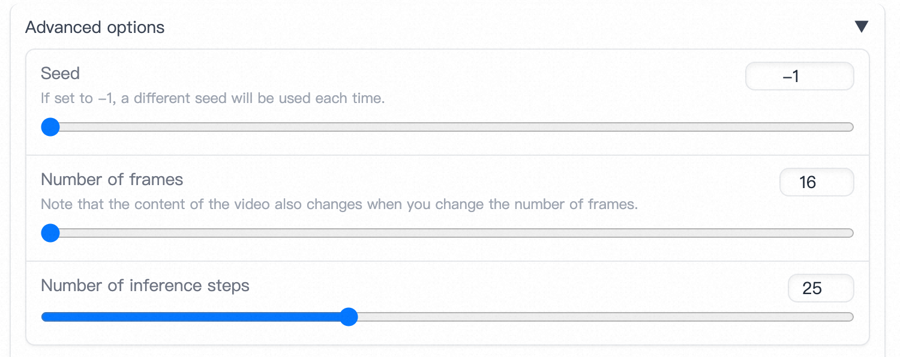

# 概述
文本-视频生成模型是由三个子网络组成的模型，包括：文本特征提取模型（Text feature extraction）、文本特征到视频扩散模型（Text feature-to-video latent space diffusion model)、视频空间映射模型（Video latent space to video visual space)。整体模型参数约为17亿。目前仅支持英文输入。扩散模型采用Unet3D结构，通过对纯高斯噪声视频进行迭代去噪处理，实现视频生成。
# 实例说明
Text to Video基于社区开源版本部署，参考源码[HuggingFace Model Card](https://huggingface.co/damo-vilab/modelscope-damo-text-to-video-synthesis)。实例规格套餐如下：

| 规格族 | vCPU与内存 | 系统盘 |
| --- | --- | --- |
| ecs.gn6i-c8g1.2xlarge | T4 GPU 计算型，8vCPU 31GiB，16G GPU RAM | ESSD云盘 200GiB PL0 |
| ecs.gn7i-* | A10 GPU计算型，*，24G GPU RAM | ESSD云盘 200GiB PL0 |

# 部署流程
## 0.准备工作
在正式开始使用前，您需要一个阿里云账号，对ECS、VPC等资源进行访问和创建操作。

- 若您使用个人账号，可以直接创建服务实例
- 若您使用RAM用户创建服务实例，且是第一次使用阿里云计算巢
   - 需要在创建服务实例前，对使用的RAM用户的账号添加相应资源的权限。添加RAM权限的详细操作，请参见[为RAM用户授权](https://help.aliyun.com/document_detail/121945.html)。所需权限如下表所示。
   - 且需要授权创建关联角色，参考下图，选中同意授权并创建关联角色

| 权限策略名称|	备注 |
| --- | --- |
|AliyunECSFullAccess |	管理云服务器服务（ECS）的权限 |
| AliyunVPCFullAccess| 	管理专有网络（VPC）的权限|
| AliyunROSFullAccess| 	管理资源编排服务（ROS）的权限| 
|AliyunComputeNestUserFullAccess|	管理计算巢服务（ComputeNest）的用户侧权限|

## 1.部署入口
您可以在[阿里云计算巢](https://computenest.console.aliyun.com/user/cn-hangzhou/recommendService)自行搜索，也可以通过下述部署链接快速到达。 [部署链接](https://computenest.console.aliyun.com/user/cn-hangzhou/serviceInstanceCreate?ServiceId=service-e09f19eadf0d424b9a80)
## 2.创建服务
### 2.1 参数列表
您在创建服务实例的过程中，需要配置服务实例信息的参数列表，具体如下：

| 参数组 | 参数项 | 示例 | 说明 |
| --- | --- | --- | --- |
| 服务实例名称 | N/A | TextToVideo-mc64 | 实例的名称 |
| 地域 | N/A | 华东1（杭州） | 选中服务实例的地域，建议就近选中，以获取更好的网络延时。 |
| 付费类型配置 | 付费类型 | 按量付费 | N/A |
| ECS实例配置 | 实例类型 | ecs.gn6i-c8g1.2xlarge | 选择T4 GPU套餐规格或自定义套餐规格 |
| ECS实例配置 | 实例密码 | **_******_** | 设置实例密码。长度8~30个字符，必须包含三项（大写字母、小写字母、数字、 ()`~!@#$%^&*_-+={}[]:;'<>,.?/ 中的特殊符号）。 |
| 登陆信息配置 | 软件登陆名 | admin | 设置软件登陆用户名 |
| 登陆信息配置 | 软件登录密码 | ****** | 设置软件登录密码 |
| 可用区配置 | 交换机可用去 | 可用区I | 地域下的不同可用区域，确保实例非空 |
| 新建网络配置 | 专有网络IPv4网络 | 192.168.0.0/16 | VPC的ip地址段范围 |
| 新建网络配置 | 交换机子网网段 | 192.168.1.0/24 | 交换机子网地址段范围 |
| 选择已有基础资源配置 | VPC ID | vpc-xxx | 按实际情况，选择专有网络的ID。 |
| 选择已有基础资源配置 | 交换机ID | vsw-xxx | 按实际情况，选择交换机ID。若找不到交换机, 可尝试切换地域和可用区 |

### 2.2 具体步骤
创建服务按如下步骤进行，参考下图：

- 填写实例名称，如下图中“TextToVideo-mc64”
- 选择地域，如下图中“华东1（杭州）”

- 选择付费类型
- 选择实例类型。
- 配置实例密码
- 配置软件登录用户名和密码

- 选择可用区
- 选择网络配置（下面两种情况二选一）
   - 新建VPC并填写网络配置
   - 选择已有的网络资源

- 点击下一步，进入订单确认页面
- 勾选“权限确认”和“服务条款”中的复选框
- 点击“立即创建”

## 3.启动Text To Video服务

- 在“服务实例管理”页面等待“部署状态”变为“已部署”。

- 点击该服务实例可进入服务实例详情。
- 点击Endpoint并输入创建服务时的用户名和密码登录软件页面。

- 输入英文Prompt，点击Generate video即可根据输入的prompt生成视频。

- 点击“Advanced options”设置更多参数。
   - Seed。选择不同的Seed将会生成不同的内容。
   - Number of frames。视频帧数。
   - Number of inference steps。推理步数，数值越高耗时越长，内容可能越好。

- 点击Examples直接查看示例。

最后，请尽情发挥你的想象力试玩吧。有任何想法或建议或者合作需求，请联系我们～～～